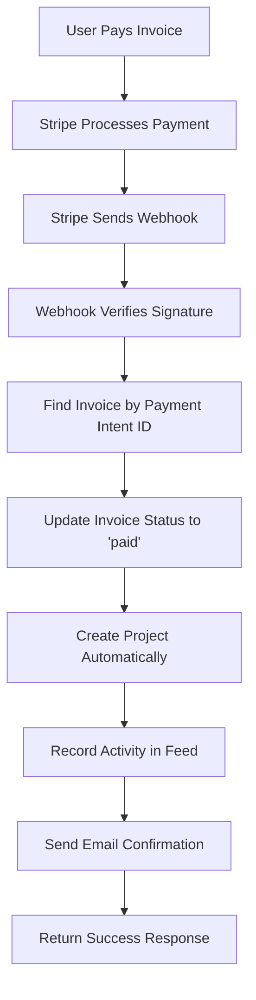

# 🚀 Production Webhook Setup Guide

## ✅ **Your Webhook is Ready!**

The Stripe webhook at `/api/invoices/webhook` is already implemented with:

- ✅ **Payment Success Handling** - Updates invoice status to "paid" 
- ✅ **Automatic Project Creation** - Creates projects after successful payment
- ✅ **Idempotency Protection** - Prevents duplicate processing
- ✅ **Activity Logging** - Records all payment events
- ✅ **Email Notifications** - Sends payment confirmations
- ✅ **Error Handling** - Comprehensive error logging and recovery

## 🔧 **Production Setup Steps**

### **1. Configure Stripe Webhook Endpoint**

1. **Go to [Stripe Dashboard → Webhooks](https://dashboard.stripe.com/webhooks)**

2. **Click "Add endpoint"**

3. **Enter your webhook URL:**
   ```
   https://your-domain.com/api/invoices/webhook
   ```

4. **Select these events to listen for:**
   - `payment_intent.succeeded` ✅ (Required)
   - `payment_intent.payment_failed` ✅ (Recommended)
   - `payment_intent.canceled` ✅ (Recommended)
   - `customer.created` ✅ (Optional)

5. **Copy the webhook signing secret** (`whsec_...`)

### **2. Update Environment Variables**

Add the webhook secret to your production environment:

```env
# Stripe Configuration
STRIPE_SECRET_KEY=sk_live_...  # Your live secret key
STRIPE_WEBHOOK_SECRET=whsec_... # From step 1 above
NEXT_PUBLIC_STRIPE_PUBLISHABLE_KEY=pk_live_... # Your live publishable key

# Existing vars...
NEXT_PUBLIC_SUPABASE_URL=https://...
SUPABASE_SERVICE_ROLE_KEY=...
SENDGRID_API_KEY=...
```

### **3. Deploy and Test**

```bash
# Deploy your app
vercel deploy --prod  # or your deployment method

# Test webhook with a real payment (use small amount)
# Navigate to: https://your-domain.com/invoices
# Pay an invoice with test card: 4242 4242 4242 4242
```

## 🧪 **Testing Tools**

### **Admin Test Endpoints**

You have access to admin-only testing endpoints:

```bash
# 1. Check invoice status
curl -X POST https://your-domain.com/api/test-webhook \
  -H "Content-Type: application/json" \
  -H "Authorization: Bearer YOUR_CLERK_TOKEN" \
  -d '{"action": "check_status", "invoiceId": "invoice-id-here"}'

# 2. Manually mark invoice as paid (if webhook failed)
curl -X POST https://your-domain.com/api/test-webhook \
  -H "Content-Type: application/json" \
  -H "Authorization: Bearer YOUR_CLERK_TOKEN" \
  -d '{"action": "mark_paid", "invoiceId": "invoice-id-here"}'

# 3. List recent invoices
curl -X POST https://your-domain.com/api/test-webhook \
  -H "Content-Type: application/json" \
  -H "Authorization: Bearer YOUR_CLERK_TOKEN" \
  -d '{"action": "list_recent"}'
```

### **Stripe CLI Testing (Local Development)**

```bash
# Install Stripe CLI
# Download from: https://stripe.com/docs/stripe-cli

# Login to Stripe
stripe login

# Forward webhooks to local endpoint
stripe listen --forward-to localhost:3000/api/invoices/webhook

# Test with sample events
stripe trigger payment_intent.succeeded
```

## 📊 **What Happens When Payment Succeeds**



## 🔍 **Monitoring Webhook Health**

### **Check Webhook Logs**

1. **Stripe Dashboard:**
   - Go to Webhooks → Your endpoint
   - View "Recent attempts" tab
   - Look for 200 status codes (success)

2. **Your App Logs:**
   Look for these success patterns:
   ```
   ✅ Webhook signature verified successfully
   💰 Payment succeeded for Payment Intent: pi_xxx
   📋 Found invoice: { id: 'xxx', status: 'pending' }
   ✅ Invoice status updated to paid successfully!
   ✅ Project created successfully: xxx
   🎉 Invoice payment processed successfully: xxx
   ```

### **Common Issues & Solutions**

| Issue | Symptoms | Solution |
|-------|----------|----------|
| **Wrong Webhook URL** | No webhook logs appear | Update URL in Stripe Dashboard |
| **Invalid Signature** | `❌ Webhook signature verification failed` | Update `STRIPE_WEBHOOK_SECRET` |
| **Invoice Not Found** | `❌ Invoice not found for payment intent` | Check if payment intent IDs are stored correctly |
| **Database Errors** | `❌ Error updating invoice status` | Check RLS policies and service role key |

## 🚨 **Emergency Recovery**

If webhooks fail and invoices aren't updating:

### **Option 1: Manual Test Endpoint (Admin Only)**
```bash
POST /api/test-webhook
{
  "action": "mark_paid",
  "invoiceId": "your-invoice-id"
}
```

### **Option 2: Use Sync Endpoint**
Navigate to: `https://your-domain.com/api/sync-invoice-status` (Admin only)

### **Option 3: Database Direct Update**
```sql
-- Last resort: Update invoice directly in Supabase
UPDATE invoices 
SET status = 'paid', paid_at = NOW() 
WHERE id = 'your-invoice-id' AND status = 'pending';
```

## ✅ **Production Checklist**

- [ ] Webhook endpoint added to Stripe Dashboard
- [ ] Correct events selected (`payment_intent.succeeded`, etc.)
- [ ] Webhook secret added to environment variables
- [ ] Test payment completed successfully
- [ ] Invoice status updates from "pending" → "paid"
- [ ] Project automatically created
- [ ] Activity logged in community feed
- [ ] Email confirmations sent
- [ ] Stripe Dashboard shows 200 responses

## 📈 **Expected Webhook Volume**

- **Per Invoice Payment:** 1 webhook (`payment_intent.succeeded`)
- **Failed Payments:** 1 webhook (`payment_intent.payment_failed`)
- **Canceled Payments:** 1 webhook (`payment_intent.canceled`)

All webhooks are processed efficiently with proper error handling and idempotency protection.

---

🎉 **Your Stripe integration is production-ready!** The webhook will automatically handle all payment processing and invoice status updates. 